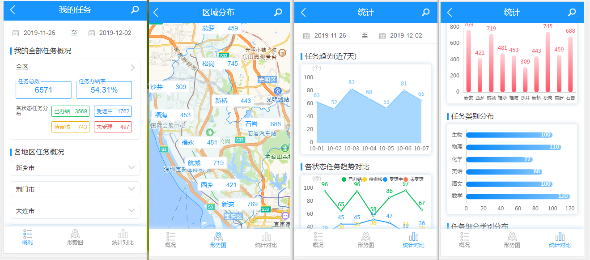
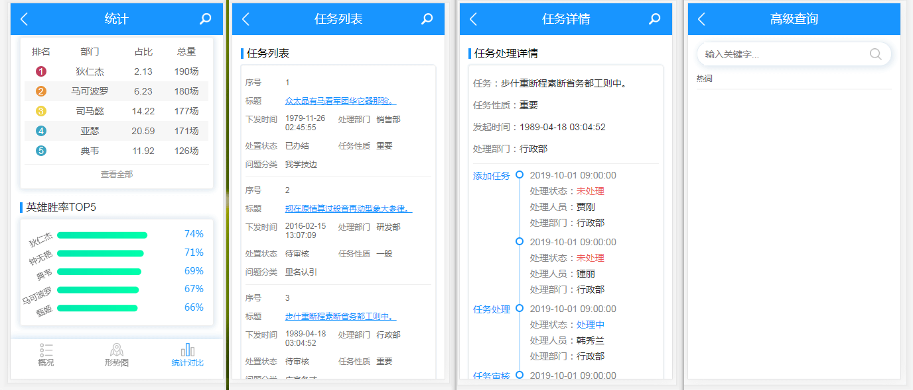

<p align="center">基于 Vue 和 Mint UI 构建的移动端 Web App</p>

<p align="center">
  <a href="https://cli.vuejs.org/" rel="nofollow" target="_blank">
    
  </a>
  <a href="https://github.com/vuejs/vue" rel="nofollow" target="_blank">
    
  </a>
  <a href="http://mint-ui.github.io/" rel="nofollow" target="_blank">
    
  </a>
  <a href="https://travis-ci.org/Neveryu/map-chart" rel="nofollow" target="_blank">
    
  </a>
  <a href="https://github.com/Neveryu/vue-cms/blob/master/LICENSE">
    
  </a>
  <a href="https://neveryu.github.io/reward/index.html" target="_blank">
    
  </a>
</p>

## 预览
在线体验：[https://git.io/JeMCZ](https://neveryu.github.io/map-chart/index.html)

## 简介
`map-chart` 用最新的 Vue-CLI 工具搭建，基于 Vue 和 Mint UI构建。它使用了最新的前端技术栈，内置了高德地图（AMap）的使用方案以及 EChart 的使用和多种配置方案，支持动态路由，模拟数据，搜索，地图，数据统计等很多功能特性。

同时，它也是一个很好的学习项目，包含了一些常见问题的解决方案，比如：前端数据模拟，数据可视化，PWA，移动端地图，图表等等。

## 截图
<!--  -->
<!--  -->

## Project setup
```
npm install
```

### Compiles and hot-reloads for development
```
npm run serve
or
npm start
```

### Compiles and minifies for production
```
npm run build
```

### Run your tests
```
npm run test
```

### Lints and fixes files
```
npm run lint
```

### Lints and NO fixes files
```
npm run nofix
```

## Donate

如果你觉得这个项目帮助到了你，你可以帮作者买一杯果汁表示鼓励 :tropical_drink:


## Browsers support

Modern browsers and Internet Explorer 10+.

| [](http://godban.github.io/browsers-support-badges/)</br>IE / Edge | [](http://godban.github.io/browsers-support-badges/)</br>Firefox | [](http://godban.github.io/browsers-support-badges/)</br>Chrome | [](http://godban.github.io/browsers-support-badges/)</br>Safari |
| --------- | --------- | --------- | --------- |
| IE10, IE11, Edge| last 2 versions| last 2 versions| last 2 versions

## License

[MIT](https://github.com/Neveryu/vue-cms/blob/master/LICENSE)

Copyright (c) 2019-present NeverYu

